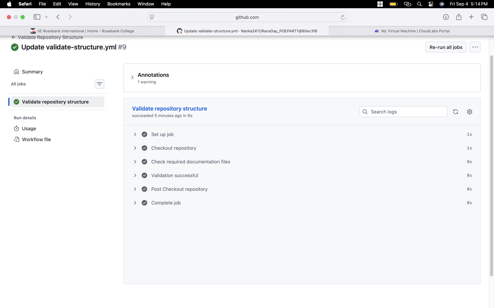

🏃‍♀️🏁 Race_Day

📌 Project Overview

Race_Day is a race and event management system designed to manage users, organisers, participants, events, event categories, enrolments, and race results.

The system uses a relational database to store and manage race-day information and provides REST API endpoints for interacting with the system. 🗄️💻

⸻

📚 Assignment Description

This assignment focuses on the design and development of a Race_Day race and event management system. The system is designed to demonstrate the use of database design, relational database management, REST API development, user roles, and version control.

The project requires the development of a structured database that manages race events, organisers, participants, categories, enrolments, and race results. It also includes REST API endpoints that allow users and organisers to interact with the system.

The project demonstrates the ability to:

* 🗄️ Design and implement a relational database.
* 🔗 Establish relationships between database tables using Primary Keys (PKs) and Foreign Keys (FKs).
* 🔌 Design REST API endpoints for system functionality.
* 👥 Implement different user roles and responsibilities.
* 📝 Manage participant enrolments in race events.
* 🏆 Record and manage race results.
* 🐙 Use GitHub for version control and project documentation.
* ⚙️ Use GitHub Actions to validate the repository structure.

⸻

🗄️ Database

The database is named:

Race_Day

📋 Database Tables

Table	Description
👤 Account	Stores user account information
🧑‍💼 Organiser	Stores information about event organisers
🏃 Participant	Stores information about race participants
🏁 Event	Stores race and event information
🏷️ Category	Stores available event categories
🔗 EventCategory	Links events with their available categories
📝 Entry	Stores participant enrolments in events
🏆 Result	Stores participant race results

🔗 Database Relationships

The database uses Primary Keys (PKs) and Foreign Keys (FKs) to maintain relationships and data integrity.

Key relationships include:

* 👤 An Account can be associated with an Organiser or Participant.
* 🧑‍💼 An Organiser can create multiple Events.
* 🏁 An Event can have multiple Categories.
* 🏃 A Participant can enter Events through the Entry table.
* 📝 Each Entry can have a corresponding Result.
* 🔗 Events and Categories are connected through the EventCategory relationship.

⸻

🔌 API Endpoints

The Race_Day system provides REST API endpoints for managing accounts, profiles, events, categories, enrolments, and race results.

🔐 Authentication

Method	Route	Description
🟢 POST	/api/auth/register	Registers a new user account
🟢 POST	/api/auth/login	Authenticates a registered user

👤 Profile

Method	Route	Description
🔵 GET	/api/profile	Retrieves the logged-in user’s profile
🟡 PUT	/api/profile	Updates the logged-in user’s profile

🏁 Events

Method	Route	Description
🔵 GET	/api/events	Retrieves all available events
🔵 GET	/api/events/{id}	Retrieves details of a specific event
🟢 POST	/api/events	Creates a new event
🟡 PUT	/api/events/{id}	Updates an existing event
🔴 DELETE	/api/events/{id}	Deletes an existing event

🏷️ Categories

Method	Route	Description
🔵 GET	/api/categories	Retrieves all available categories
🔵 GET	/api/categories/{id}	Retrieves details of a specific category
🟢 POST	/api/categories	Creates a new category

🔗 Event Categories

Method	Route	Description
🟢 POST	/api/events/{eventId}/categories/{categoryId}	Associates a category with an event
🔵 GET	/api/events/{eventId}/categories	Retrieves categories associated with an event

📝 Enrolments

Method	Route	Description
🟢 POST	/api/events/{eventId}/enrolments	Enrols a participant in an event
🔵 GET	/api/events/{eventId}/enrolments	Retrieves participants enrolled in an event
🔵 GET	/api/enrolments	Retrieves the logged-in participant’s enrolments
🔴 DELETE	/api/events/{eventId}/enrolments	Cancels a participant’s enrolment

🏆 Results

Method	Route	Description
🔵 GET	/api/events/{eventId}/results	Retrieves results for an event
🔵 GET	/api/results/{id}	Retrieves a specific race result
🟢 POST	/api/entries/{entryId}/results	Records a participant’s result
🟡 PUT	/api/results/{id}	Updates an existing result

⸻

👥 User Roles

The Race_Day system has two main user roles: Organiser and Participant.

🧑‍💼 Organiser

An Organiser is responsible for managing race events and overseeing participants and results.

Organisers can:

* 🏁 Create and manage race events.
* 🏷️ Create and manage event categories.
* 🔗 Associate categories with events.
* 👥 View participants enrolled in their events.
* 🏆 Record race results.
* ✏️ Update race results.
* 📋 Manage information relating to their events.

🏃 Participant

A Participant is a user who takes part in race events managed through the system.

Participants can:

* 🔎 View available race events.
* 📋 View event details.
* 📝 Enrol in available events.
* 👀 View their own enrolments.
* ❌ Cancel their enrolments.
* 🏆 View race results.

The two roles ensure that users have appropriate responsibilities within the system and that event management activities are separated from participant activities. 🔐

⸻

🛠️ Technologies Used

* 🗄️ Microsoft SQL Server
* 💾 SQL
* 🔌 REST API
* 🐙 GitHub
* ⚙️ GitHub Actions

⸻

⚙️ Continuous Integration (CI)

GitHub Actions is used as part of the project’s Continuous Integration (CI) process.

The CI workflow automatically checks that the required project documentation files are present in the repository whenever changes are pushed to the main or master branches or when a pull request is created.

The workflow checks for:

* 📄 API_Endpoint_Plan.pdf
* 🖼️ ERDDIAGRAM.drawio.png
* 🗄️ RACE_DAY PROG_POE1.sql
* 📖 README.md

A successful workflow produces a green build, confirming that the required files have been found successfully. ✅

🟢 Successful CI Build

⸻
## 🎥 Project Walkthrough Video

[Watch my Race_Day Project Walkthrough on YouTube]

(https://youtu.be/yLE7oBicH00)
⸻

🎯 Project Purpose

The purpose of Race_Day is to provide a structured and reliable system for managing race events and participants.

The system brings together:

🏁 Events
👥 Participants
🧑‍💼 Organisers
🏷️ Categories
📝 Enrolments
🏆 Race Results

All while maintaining data integrity and organised database relationships. 🔐✨

⸻

🚀 Race Day Ready!

Plan the race. 🏁
Manage the participants. 🏃
Track the results. 🏆
